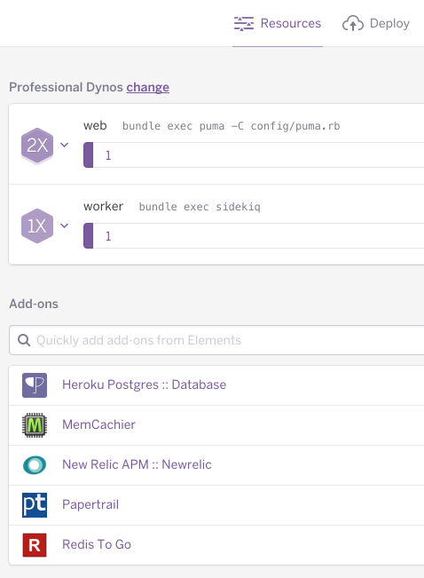

# Application Description

## Models

Models use ActiveRecord and are stored in Postgres.

## API

JSON over HTTP. Uses [ActiveModel::Serializer](https://github.com/rails-api/active_model_serializers) for converting models to JSON and [Rack CORS](https://github.com/cyu/rack-cors) for CORS HTTP headers. Look in the `ApiController` for more HTTP headers being set.

## Admin UI

There is an admin UI that lives under `/admin`. It is built using [ActiveAdmin](https://github.com/activeadmin/activeadmin). There are examples for adding a model and custom dashboard actions under `app/admin` directory.

## Background Jobs

Background jobs are run via [Sidekiq](https://github.com/mperham/sidekiq). We also include some Sidekiq plugins that provide cron jobs, a web UI for sidekiq including history and job statistics.

## Code organisation

We follow standard Rails conventions for code. In addition to those workers are under `app/workers`, actions are under `app/actions`, and services are under `app/services`.

## Hosting

The app is set up to be hosted on Heroku with the following plugins:



There are also a few environment variables you'll need to explicitly set:

```
REDIS_PROVIDER:           REDISTOGO_URL
SECRET_KEY_BASE:          asdasdasdasd
SIDEKIQ_CONCURRENCY:      5
SIDEKIQ_CRON_ENABLED:     true
```
